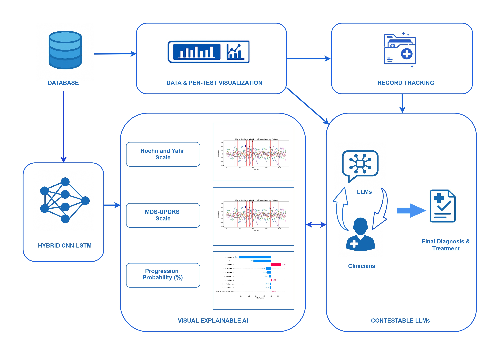
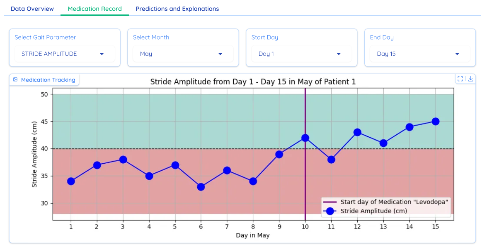
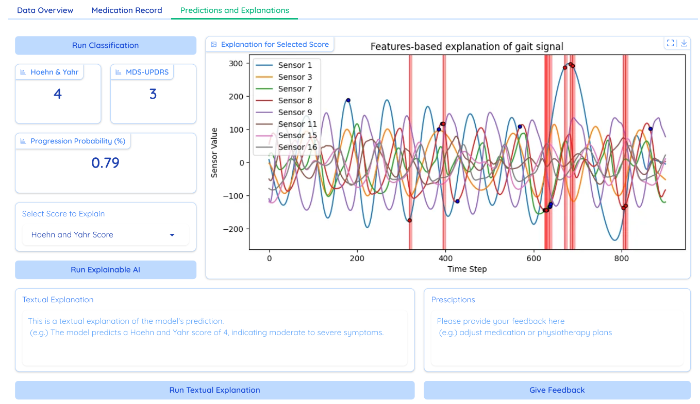

# Clinician-Centered Dashboard for Parkinson’s Disease Care

This repository contains the source code and supporting materials for a clinician-facing dashboard that integrates AI-based analysis of gait data to support Parkinson’s Disease diagnosis, monitoring, and treatment planning with **transparency**, **explainability**, and **contestability** through modular design and Expert-Guided AI Support. An overview of all components is presented as follows:



## 📝 Tab 1: Gait Session Summary
Provides a detailed visualization of sensor signals from foot-mounted IMUs during gait sessions.

Key Features:
- Time-aligned sensor signal visualization
- Patient-specific session data
- Medication info and feature selection panel
- Interactive gait metric summaries with reference ranges


---

## 📊 Tab 2: Medication History
Displays longitudinal changes in gait features relative to treatment events.

Key Features:
- Temporal trends in motor performance
- Medication timelines for contextual correlation
- Date range selection and metric filtering
- Visual support for evaluating treatment effectiveness



---

## 🔍 Tab 3: Predictive Insight and Explanation 
Presents AI-generated clinical insights with visual and textual explanations.

Key Features:
- Predictions for disease severity scores and progression probability
- XAI interpretable plots
- LLM text-based explanations
- Contestable AI principles: Clinician feedback interface for review and refinement



---

## Usage
Clone repo and install [requirements.txt](requirements.txt):

```
git clone https://github.com/hungdothanh/clinical-gait-analysis-system.git  # clone
cd clinical-gait-analysis-system
pip install -r requirements.txt  # install
```

Run demo dashboard: 
```
python demo_gui.py
```

 
